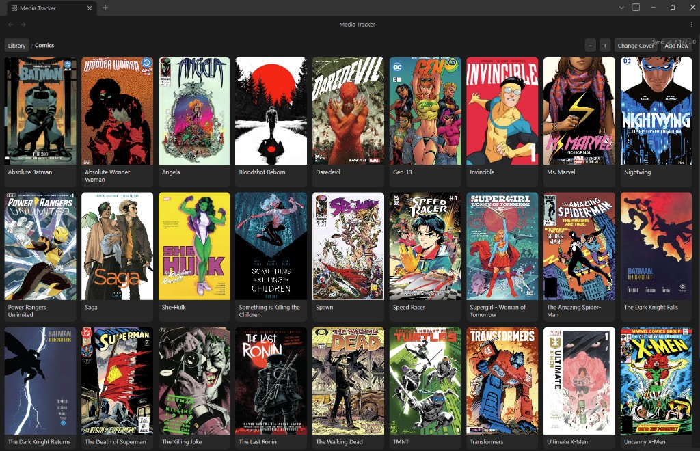

# Pegasus Media Tracker



Agnostic media tracker. Each folder is collections. Notes are items. One card grid for comics, manga, shows, or anything else with the same shape.

It is not in the Community plugin **Browse** store. You install it from this repo.

## Sponsor

If this plugin helps you, you can support development here:

- [Ko-fi](https://ko-fi.com/pegasusfly)
- [GitHub Sponsors](https://github.com/sponsors/kuarahy)

## Features

- **Card grid** — folders are collections, notes are items. Nested collections are allowed.
- **Covers** — from `cover:` on the note, an embed, an image in the folder, or `assets/covers/`. png, jpg, webp, avif, gif, bmp, svg. Vault-root image dumps move into `assets/covers/`.
- **Read** — on series issues, toggles `done`. Green when read. Hidden on libraries (library root, Comics, Covers Collection, and other top-level folders). Per-folder `action:` can relabel the button (e.g. Watched).
- **Add New** — on a library or parent collection, creates a child folder plus `Cover.md`.
- **Add Next** — in a series folder, creates the next numbered note, cloning however you already number (`#16` → `#17`, `5` → `6`, `.6` → `.7`, `v6` → `v7`).
- **Change Title** — display name on `Cover.md` for a collection. Hidden on the library root. Does not rename the folder.
- **Change Cover** — open `Cover.md` to paste/drop an image, or write a vault path / wikilink into `cover:`.
- **Zoom** — **− / +** or Ctrl/Cmd + scroll. Integer columns that snap to the pane. Saved.
- **Navigation** — click to drill in, breadcrumb to go up, mouse back / forward like a browser. Opening a note is not a history step.
- **Homepage by default** — optional. When on, the library grid opens when Obsidian starts. Off unless you turn it on in settings.
- **Ribbon and commands** — **Open Pegasus Media Tracker**, **Add next item**.

## Install into a vault

Obsidian only loads three files. The folder name must match the plugin id: `pegasus-media-tracker`.

If you already installed this as `media-tracker`, rename that folder to `pegasus-media-tracker` and re-enable the plugin. Obsidian treats it as a new plugin.

1. Build (from this repo):

   ```bash
   npm install
   npm run build
   ```

   `npm run dev` also writes `main.js` and is fine if you leave the watcher running.

2. Copy these files into the vault:

   ```
   <vault>/.obsidian/plugins/pegasus-media-tracker/main.js
   <vault>/.obsidian/plugins/pegasus-media-tracker/manifest.json
   <vault>/.obsidian/plugins/pegasus-media-tracker/styles.css
   ```

   Do not copy `src/`, `node_modules/`, or the git repo into that folder. Obsidian will ignore them.

3. In Obsidian:

   - Reload the app (`Ctrl+R` / `Cmd+R`), or close and reopen the vault.
   - **Settings → Community plugins**: turn **Restricted mode** off.
   - Enable **Pegasus Media Tracker** in the installed-plugin list. Do not look under **Browse**.

If the plugin is missing after a reload, the folder is named wrong, `manifest.json` is not next to `main.js`, or Restricted mode is still on.

### Develop against a vault

Either copy `main.js` after each build, or clone/symlink this repo to `<vault>/.obsidian/plugins/pegasus-media-tracker/` and run `npm run dev` there so Obsidian picks up rebuilds. Reload the plugin (or the app) after the first build.

## Open the grid

After it is enabled:

- Left ribbon: the grid icon (**Open Pegasus Media Tracker**), or
- Command palette (`Ctrl+P` / `Cmd+P`): **Open Pegasus Media Tracker**

Settings for this plugin are under **Settings → Pegasus Media Tracker**. **Homepage by default** is off unless you turn it on.

### If the grid is empty

The default library folder is `Media`. If your vault *is* the library (for example `Comics/` and `Manga/` at the vault root), set **Library folder** to **Vault root**.

If `Media` does not exist, the view says so. **Create folder** makes it; it does not create a note until you press **Add New** or **Add Next** again.

## Use the grid

- Click a collection card to drill in.
- Mouse back / forward (side buttons) goes to the previous / next collection you opened. Opening a note is not a history step. The breadcrumb still works.
- Click an item title (or the card) to open the note.
- Click **Read** (or your label) to set `done: true` on an issue in a series folder. Libraries (library root, Comics, Covers Collection, and other top-level folders) do not show Read. The button stays **Read** and turns green. Click it again to clear `done`.
- On a parent folder (library root, Comics, anything with subcollections), **Add New** asks for a name and creates that folder plus `Cover.md` inside it. `:` and other characters that Windows forbids in paths are kept as the card title; the folder name is slugged (`Supergirl: Woman of Tomorrow` → `Supergirl - Woman of Tomorrow`). Use **Add New** or **Change Title** for a colon in the title. Renaming the folder in the file tree cannot contain `:`.
- **Change Title** sets `title:` on `Cover.md` for the current collection. It is hidden on the library root. The folder path does not change.
- **Change Cover** on the current folder ensures `Cover.md`, then either opens it (paste or drop an image) or lets you type a vault path / wikilink to write `cover:` on that note.
- On a series folder, **Add Next** creates the next numbered note. It takes the highest trailing number among sibling notes and reuses that file's prefix: `X-Men #16` → `X-Men #17`, `Saga 5` → `Saga 6`, `.6` → `.7`, `v6` → `v7`. If nothing is numbered yet, you get `{folder name} #1`.
- **−** adds a column (smaller cards); **+** removes one (larger cards). The grid snaps so a row of cards meets the pane edges. The column count is saved.

The grid opens as a tab in the main workspace. Command palette **Add next item** follows the same Add New / Add Next rule as the toolbar, for the open grid folder, or for the folder of the active note if the grid is closed.

A **Not synchronized** / invalid-path banner under files comes from **Self-hosted LiveSync** (or Obsidian Sync), not this plugin. Configure ignore rules and allowed paths there. Pegasus Media Tracker does not move LiveSync’s status UI.

## Vault layout

Collections can nest. Mixed folders are allowed: subfolders are collection cards, markdown notes are item cards.

```
Media/                          ← default library folder
  Comics/
    X-Men/
      Cover.md
      X-Men #1.md
      X-Men #16.md
  Manga/
    Death Note/
      Death Note #1.md
  Shows/
    Good Girls/
      Season 1/
        Good Girls S01 #1.md
```

A note named **Cover** inside a collection folder is the cover / action note for that collection. It is not shown as an item card. **Add New** creates `Cover.md`. Older vaults may still use a note named like the folder (`X-Men/X-Men.md`); that still counts and is hidden from the grid. If a collection has no cover of its own, the grid uses a matching file in `assets/covers/`, then the first child collection's cover, then the first child's item cover.

Folders named `assets` or `covers` (any case) are skipped in the grid so attachment files are not a collection. Other folders, including one named **Covers Collection**, are real collections. Images dropped at the vault root are moved into `assets/covers/`.

## Frontmatter

Item note:

```yaml
---
cover: "[[covers/xmen-1.jpg]]"
done: false
---
```

`cover` may be a wikilink, a vault path, or an `http(s)` URL. Image files include png, jpg, jpeg, gif, webp, bmp, svg, and avif. If `cover` is missing, the plugin uses the first embedded image in the note, then the first image file in the same folder. No covers are downloaded from the internet.

Collection folder note (optional):

```yaml
---
title: "Supergirl: Woman of Tomorrow"
action: Watched
cover: "[[covers/good-girls.jpg]]"
---
```

`title` is the card and breadcrumb label. If it is missing, the folder name is used. `action` overrides the button label for items in that folder only.

## Settings

| Setting | Default | Meaning |
| --- | --- | --- |
| Library folder | `Media` | Only this folder is scanned. **Vault root** scans the whole vault. |
| Homepage by default | off | Opens the library grid when Obsidian starts. |
| Action label | `Read` | Button text on item cards. A collection folder note can override this with an action property. |
| Grid columns | `6` | How many cards per row (clamped so cards stay at least ~110px). Changed from the **− / +** buttons. |

## Commands

| Command | What it does |
| --- | --- |
| Open Pegasus Media Tracker | Opens or focuses the grid view in the main workspace |
| Add next item | **Add New** or **Add Next**, matching the open folder |

## Repository

| Path | Role |
| --- | --- |
| `src/main.ts` | Plugin lifecycle (load, ribbon, settings, view) |
| `src/library.ts` | Vault folders → collection / item nodes |
| `src/naming.ts` | Next numbered title (clones `#` / space / `.` / `v` / …) |
| `src/cover.ts` | Cover from frontmatter, embeds, folder images, or first child |
| `src/actions.ts` | Toggle `done`, create the next note or collection |
| `src/settings.ts` | Settings tab |
| `src/commands.ts` | Command palette |
| `src/ui/` | Grid view and cards |
| `manifest.json` | Plugin id `pegasus-media-tracker` |
| `styles.css` | Grid layout |
| `PLAN.md` | Engineering plan |

Release artifacts (not committed): `main.js` from `npm run build` or `npm run dev`.

```bash
npm install
npm run dev      # watch, writes main.js
npm run build    # typecheck + production bundle
```

Requires Node 18+. No extra runtime dependencies; Obsidian APIs only.

## License

MIT. See `LICENSE.md`. Copyright (c) 2026 Lucas Perez (GitHub: kuarahy).

Please keep this attribution in documentation and other user-facing notices:

    Pegasus Media Tracker by Lucas Perez (@kuarahy)
    https://github.com/kuarahy/pegasus-media-tracker
