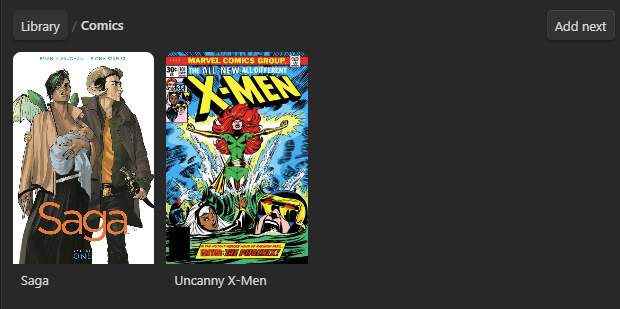
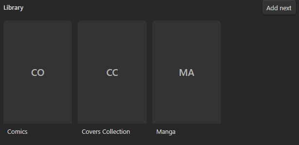
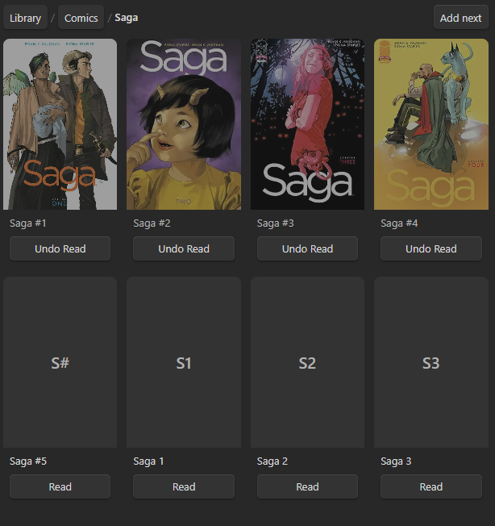
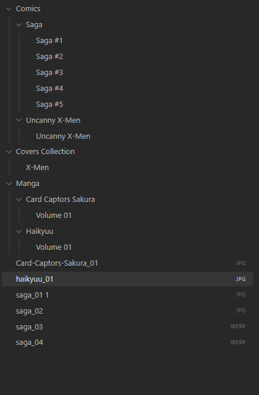
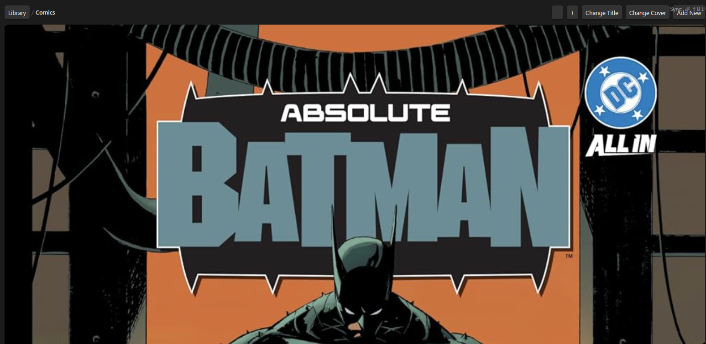

TODO

Code clarity:
- [ ] We need comments to understand which functions do what, code now is very undocumented, we may need more documentation on how to use the app as well on the repository

Completed:
- [X] If "Read" is pressed, it shouldn't swap to "Undo Read", but something that tells that it's read, pressing again
would unread/unwatch, etc
- [X] When I click on Open Media Tracker it displays as a sidebar on the right side, I want that to be able to be on the main region of the app

- [X] Maybe bug: every file has this under them "Not synchronized: this file has an invalid path under the current settings" -- still persists
![[saga_03.webp]]
- [X] Bug: the comics parent should not display the "Add Next" button, but an "Add New", which would add a new parent folder library collection

- [X] Bug: button Add Next overwrites Sync on top right, what would be the best approach? Maybe we should change that button to some other color too for visibility? Or just move it a bit somewhere else? (or add css to LiveSync to the bottom right of the main section? Preferred.)
- [X] Bug: The tab should be called Media Tracker, not Media tracker
- [X] Feature: when a new parent folder library is added by the Add New, it should add a child note to it, whenever the parent name changes, that note should also change, that way, the cover is never broken because the user just changed the name of it a bit
- [X] Every collection (eg X-Men) should contain a Cover note whenever created too. If I click to create a new library, it should add a cover note, the cover note is the image that displays on the library list (image below), any parent library would have their cover too, if one isn't attributed, it should have a fallback to the first one on the child list 

- [X] Bug: if I click on Saga #5, it adds Saga 1, Saga 2, Saga 3, instead of Saga #6, it should accept either, and understand the numbering sequence -- still persists

- [X] The images added to a comic/shows/library/etc shouldn't be placed at the root at the vault, but in a folder that is not displayed in Obsidian as another collection (eg covers/other name)
This would avoid them displaying as such (at the bottom)

- [X] Bug: Covers Collection shouldn't be hidden from the Media Tracker, it is a library name
- [X] Feature: zooming in and out of the Media Tracker so grids are as big or small as users want, it should "snap at the corners" by calculating the size of
- [X] Bug: "Not synchronized" message still present, even if items are synchronized
- [X] Question/Bug: the sync location change shouldn't be attached to this code. It's part of another plugin. If it's attached to this plugin work, it's a bug.
- [X] Feature: The cover note should be called "Cover" instead of the name of the series to make it really obvious where it resides
- [X] Feature: Change Cover button alongside Add Next (it should open the note where you add a cover, or an input where someone would add the cover from there, which would generate the image link within the note where a cover is created).

- [X] Bug: Add new should be Add New
- [X] Bug : Add next should be Add Next
- [X] Feature: collections names should display fully and not hide (eg Absolute Wonder Wom... should be Absolute Wonder Woman). Evaluate if zoom solves it.
