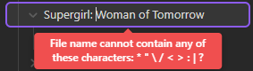

TODO

New: 
- [ ] Feature: navigation, mouse buttons should accept navigation like browsers, if you backwards and forwards options to make sure navigation is faster. eg if I click a collection, I can press the backwards to see the all collections and then press forward on my mouse again and seeing the collection where I was at without depending on clicking the Library button or the collection to go anywhere.
- [ ] Bug: Cannot add : to collection names in the prompt eg Supergirl: Woman of Tomorrow throws errors

- [ ] Change Title button alongside Change Cover and Add Next
- [ ] Start Obsidian at Media Tracker homepage
- [ ] Homepage sections Library, Shows, Books as different rows
- [ ] Feature: Name change to Pegasus Media Tracker
- [ ] AVIF support

Code clarity:
- [ ] We need comments to understand which functions do what, code now is very undocumented, we may need more documentation on how to use the app as well on the repository
