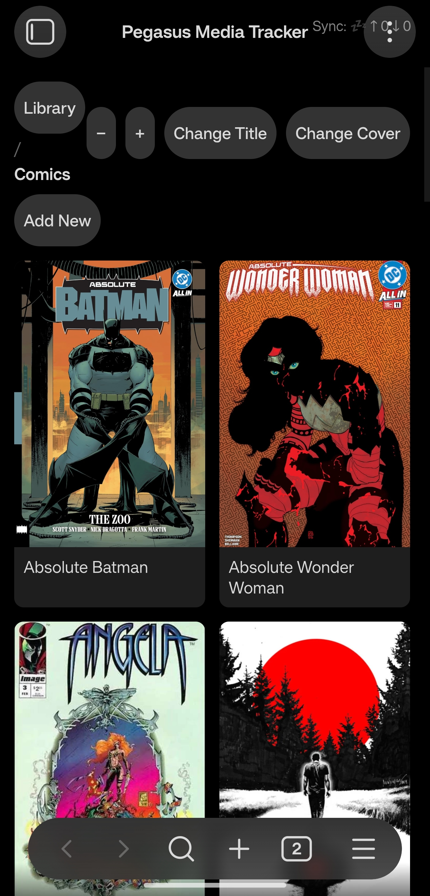
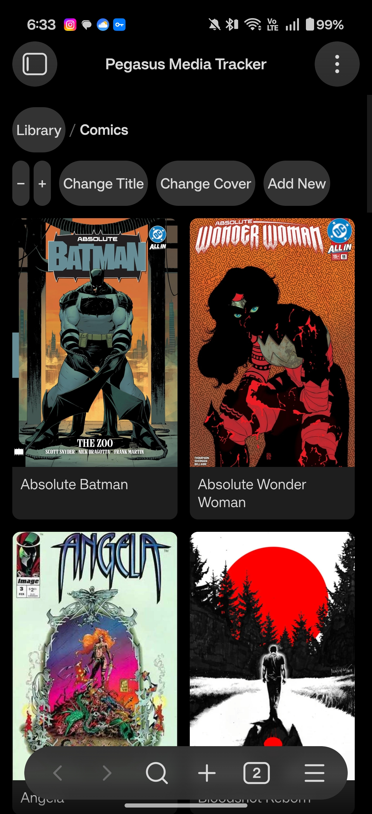

# TODO

Bugs 
- [ ] Bug: unintended round button is a change that was not specified

  - **Root cause**: `.media-tracker-zoom` and the other toolbar button classes (`.media-tracker-breadcrumb-link`, `.media-tracker-add`, `.media-tracker-cover`, `.media-tracker-title`) never set their own `border-radius` in styles.css, so they inherit the theme's default button radius. On the narrow, near-square zoom buttons that radius renders as a full circle; on the wider buttons (`Change Title`, `Add New`, breadcrumb links) the same radius renders as a pill. The grouping fix in 3b0d133 kept `−`/`+` wrapping together as a pair but never gave them their own shape, so they still show as two separate circles instead of matching the rest of the toolbar.
  - **Plan**:
    1. Add an explicit `border-radius: var(--radius-m)` to the shared toolbar-button selector so shape is consistent and no longer dependent on a button's width.
    2. Re-check `−`/`+` at the grouped mobile breakpoint (~390px) against img0.jpg/img1.jpg to confirm they now match `Change Title` / `Add New`.
    3. Spot-check desktop width too, since the shared selector applies outside the `@media (max-width: 420px)` block.
